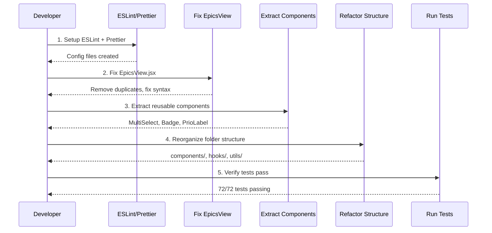

# Design Document: Technical Refactoring

## Overview

Технический рефакторинг roadmap-app для приведения проекта в здоровое состояние. Основные проблемы: поврежденный EpicsView.jsx (39 синтаксических ошибок), отсутствие линтера/форматтера, дублирование кода, большие компоненты (600+ строк), inline стили, отсутствие обработки ошибок и компонентной структуры.

## Main Algorithm/Workflow



## Core Interfaces/Types

### ESLint Configuration

```javascript
// .eslintrc.cjs
module.exports = {
  root: true,
  env: { browser: true, es2020: true },
  extends: [
    'eslint:recommended',
    'plugin:react/recommended',
    'plugin:react/jsx-runtime',
    'plugin:react-hooks/recommended',
  ],
  ignorePatterns: ['dist', '.eslintrc.cjs'],
  parserOptions: { ecmaVersion: 'latest', sourceType: 'module' },
  settings: { react: { version: '18.3' } },
  plugins: ['react-refresh'],
  rules: {
    'react-refresh/only-export-components': [
      'warn',
      { allowConstantExport: true },
    ],
    'react/prop-types': 'off',
  },
}
```

### Prettier Configuration

```javascript
// .prettierrc
{
  "semi": false,
  "singleQuote": true,
  "tabWidth": 2,
  "trailingComma": "es5",
  "printWidth": 100,
  "arrowParens": "avoid"
}
```

### New Folder Structure

```
src/
  components/
    common/
      MultiSelect.jsx
      Badge.jsx
      PrioLabel.jsx
      ArtIcon.jsx
    views/
      EpicsView.jsx
      ScrumbanView.jsx
      GanttView.jsx
      RetroView.jsx
      SprintReview.jsx
      SettingsView.jsx
    layout/
      Modal.jsx
  hooks/
    useCollapsed.js
    useTaskFilters.js
  utils/
    sortTasks.js
    constants.js
    errorHandler.js
  services/
    supabase.js
    store.js
  App.jsx
  Auth.jsx
  main.jsx
  index.css
  tests/
```

## Key Functions with Formal Specifications

### Function 1: fixEpicsView()

```javascript
function fixEpicsView(fileContent)
```

**Preconditions:**
- `fileContent` is a string containing the damaged EpicsView.jsx code
- File contains duplicate constant declarations (PRIO_ORDER, SEL_STYLE, SORT_OPTIONS)

**Postconditions:**
- Returns valid JavaScript/JSX code with no syntax errors
- All duplicate declarations removed
- Original functionality preserved
- getDiagnostics returns 0 errors

**Implementation Strategy:**
1. Remove lines 4-5 (duplicate PRIO_ORDER)
2. Remove lines 9-10 (duplicate SEL_STYLE)
3. Remove lines 111-113 (duplicate SEL_STYLE, SORT_OPTIONS)
4. Verify syntax with getDiagnostics

### Function 2: extractMultiSelect()

```javascript
function extractMultiSelect(sourceFile, targetFile)
```

**Preconditions:**
- `sourceFile` contains MultiSelect component implementation
- `targetFile` path is valid and writable

**Postconditions:**
- MultiSelect component extracted to `src/components/common/MultiSelect.jsx`
- Source file imports MultiSelect from new location
- Component interface unchanged
- All tests pass

**Component Interface:**
```javascript
<MultiSelect
  label={string}
  options={Array<{value: string, label: string}>}
  selected={Array<string>}
  onChange={(selected: Array<string>) => void}
/>
```

### Function 3: setupErrorHandling()

```javascript
async function withErrorHandling(asyncFn, errorMessage)
```

**Preconditions:**
- `asyncFn` is an async function
- `errorMessage` is a descriptive string

**Postconditions:**
- Returns result of `asyncFn` on success
- Catches errors and logs with context
- Shows user-friendly error message
- Never throws unhandled exceptions

**Implementation:**
```javascript
// src/utils/errorHandler.js
export async function withErrorHandling(asyncFn, errorMessage) {
  try {
    return await asyncFn()
  } catch (error) {
    console.error(`${errorMessage}:`, error)
    alert(`Ошибка: ${errorMessage}. Проверьте консоль для деталей.`)
    return null
  }
}
```

## Algorithmic Pseudocode

### Main Refactoring Algorithm

```pascal
ALGORITHM refactorRoadmapApp()
INPUT: current project structure
OUTPUT: refactored project with improved code quality

BEGIN
  // Phase 1: Setup tooling
  CALL installDependencies(['eslint', 'prettier', 'eslint-plugin-react'])
  CALL createESLintConfig()
  CALL createPrettierConfig()
  CALL addScriptsToPackageJson(['lint', 'format'])
  
  // Phase 2: Fix critical issues
  epicsContent ← READ_FILE('src/EpicsView.jsx')
  fixedContent ← removeDuplicateConstants(epicsContent)
  WRITE_FILE('src/EpicsView.jsx', fixedContent)
  
  diagnostics ← getDiagnostics(['src/EpicsView.jsx'])
  ASSERT diagnostics.length = 0
  
  // Phase 3: Extract reusable components
  CALL extractComponent('MultiSelect', 'src/ScrumbanView.jsx', 'src/components/common/MultiSelect.jsx')
  CALL extractComponent('Badge', 'src/EpicsView.jsx', 'src/components/common/Badge.jsx')
  CALL extractComponent('PrioLabel', 'src/EpicsView.jsx', 'src/components/common/PrioLabel.jsx')
  
  // Phase 4: Reorganize structure
  CALL createFolderStructure([
    'src/components/common',
    'src/components/views',
    'src/components/layout',
    'src/hooks',
    'src/utils',
    'src/services'
  ])
  
  CALL moveFiles([
    ('src/EpicsView.jsx', 'src/components/views/'),
    ('src/ScrumbanView.jsx', 'src/components/views/'),
    ('src/Modal.jsx', 'src/components/layout/'),
    ('src/store.js', 'src/services/'),
    ('src/supabase.js', 'src/services/')
  ])
  
  // Phase 5: Add error handling
  CALL wrapAsyncFunctions('src/services/supabase.js', withErrorHandling)
  CALL wrapAsyncFunctions('src/services/store.js', withErrorHandling)
  
  // Phase 6: Extract constants and utilities
  CALL extractConstants('src/utils/constants.js')
  CALL extractSortFunction('src/utils/sortTasks.js')
  CALL extractHook('useCollapsed', 'src/hooks/useCollapsed.js')
  
  // Phase 7: Format and lint
  CALL runCommand('npm run format')
  CALL runCommand('npm run lint')
  
  // Phase 8: Verify
  tests ← runCommand('npm test')
  ASSERT tests.passed = 72
  ASSERT tests.failed = 0
  
  RETURN "Refactoring complete"
END
```

### Remove Duplicate Constants Algorithm

```pascal
ALGORITHM removeDuplicateConstants(fileContent)
INPUT: fileContent - string containing JavaScript code with duplicates
OUTPUT: cleanContent - string with duplicates removed

BEGIN
  lines ← SPLIT(fileContent, '\n')
  seenConstants ← EMPTY_SET
  cleanLines ← EMPTY_ARRAY
  
  FOR i FROM 0 TO LENGTH(lines) - 1 DO
    line ← lines[i]
    
    // Check if line declares a constant
    IF MATCHES(line, /^const\s+(\w+)\s*=/) THEN
      constantName ← EXTRACT_NAME(line)
      
      IF constantName IN seenConstants THEN
        // Skip duplicate declaration
        CONTINUE
      ELSE
        seenConstants.ADD(constantName)
        cleanLines.APPEND(line)
      END IF
    ELSE
      cleanLines.APPEND(line)
    END IF
  END FOR
  
  cleanContent ← JOIN(cleanLines, '\n')
  RETURN cleanContent
END
```

## Example Usage

### 1. Fix EpicsView.jsx

```javascript
// Before (damaged)
const PRIO_ORDER = { critical: 0, high: 1, medium: 2, low: 3 }
const PRIO_ORDER = { critical: 0, high: 1, medium: 2, low: 3 } // DUPLICATE
const SEL_STYLE = { fontSize: 12, ... }
const SEL_STYLE = { fontSize: 12, ... } // DUPLICATE

// After (fixed)
const PRIO_ORDER = { critical: 0, high: 1, medium: 2, low: 3 }
const SEL_STYLE = { fontSize: 12, padding: '6px 10px', ... }
```

### 2. Extract MultiSelect Component

```javascript
// src/components/common/MultiSelect.jsx
import { useState, useRef, useEffect } from 'react'

export default function MultiSelect({ label, options, selected, onChange }) {
  const [open, setOpen] = useState(false)
  const ref = useRef(null)

  useEffect(() => {
    function handleClick(e) {
      if (ref.current && !ref.current.contains(e.target)) setOpen(false)
    }
    document.addEventListener('mousedown', handleClick)
    return () => document.removeEventListener('mousedown', handleClick)
  }, [])

  const allSelected = selected.length === 0
  const displayLabel = allSelected ? label : `${label} (${selected.length})`

  function toggle(val) {
    if (selected.includes(val)) {
      onChange(selected.filter(v => v !== val))
    } else {
      onChange([...selected, val])
    }
  }

  return (
    <div ref={ref} style={{ position: 'relative' }}>
      <button onClick={() => setOpen(o => !o)} style={buttonStyle}>
        {displayLabel}
        <span style={{ fontSize: 9, marginLeft: 2 }}>{open ? '▲' : '▼'}</span>
      </button>
      {open && (
        <div style={dropdownStyle}>
          <div style={allOptionStyle} onClick={() => onChange([])}>
            ✓ Все
          </div>
          <div style={dividerStyle} />
          {options.map(opt => (
            <label key={opt.value} style={optionStyle}>
              <input
                type="checkbox"
                checked={selected.includes(opt.value)}
                onChange={() => toggle(opt.value)}
                style={checkboxStyle}
              />
              {opt.label}
            </label>
          ))}
        </div>
      )}
    </div>
  )
}
```

### 3. Usage in Views

```javascript
// src/components/views/ScrumbanView.jsx
import MultiSelect from '../common/MultiSelect'

export default function ScrumbanView({ epics, tasks, onEditTask, settings }) {
  const [prioFilter, setPrioFilter] = useState([])
  const [assigneeFilter, setAssigneeFilter] = useState([])
  
  return (
    <div>
      <MultiSelect
        label="Приоритет"
        options={priorities.map(p => ({ value: p, label: priorityLabels[p] }))}
        selected={prioFilter}
        onChange={setPrioFilter}
      />
      <MultiSelect
        label="Ответственный"
        options={assignees.map(a => ({ value: a, label: a }))}
        selected={assigneeFilter}
        onChange={setAssigneeFilter}
      />
    </div>
  )
}
```

### 4. Error Handling Wrapper

```javascript
// src/services/supabase.js
import { withErrorHandling } from '../utils/errorHandler'

export async function loadTasksFromSupabase(userId) {
  return withErrorHandling(
    async () => {
      const { data, error } = await supabase
        .from('tasks')
        .select('*')
        .eq('user_id', userId)
      
      if (error) throw error
      return data
    },
    'Не удалось загрузить задачи из Supabase'
  )
}

export async function saveTaskToSupabase(task, userId) {
  return withErrorHandling(
    async () => {
      const { data, error } = await supabase
        .from('tasks')
        .upsert({ ...task, user_id: userId })
      
      if (error) throw error
      return data
    },
    'Не удалось сохранить задачу в Supabase'
  )
}
```

### 5. Extract useCollapsed Hook

```javascript
// src/hooks/useCollapsed.js
import { useState } from 'react'

export function useCollapsed(storageKey) {
  const [state, setState] = useState(() => {
    try {
      return JSON.parse(localStorage.getItem(storageKey) || '{}')
    } catch {
      return {}
    }
  })

  const toggle = (id) => {
    setState(current => {
      const next = { ...current, [id]: !current[id] }
      try {
        localStorage.setItem(storageKey, JSON.stringify(next))
      } catch (error) {
        console.error('Failed to save collapsed state:', error)
      }
      return next
    })
  }

  return [state, toggle]
}
```

### 6. Extract Constants

```javascript
// src/utils/constants.js
export const PRIO_COLORS = {
  critical: '#E24B4A',
  high: '#EF9F27',
  medium: '#378ADD',
  low: '#888780'
}

export const PRIO_ORDER = {
  critical: 0,
  high: 1,
  medium: 2,
  low: 3
}

export const STATUS_BG = {
  backlog: '#F1EFE8',
  ready: '#FAEEDA',
  wip: '#E6F1FB',
  done: '#EAF3DE',
  frozen: '#FCEBEB'
}

export const STATUS_TX = {
  backlog: '#5F5E5A',
  ready: '#854F0B',
  wip: '#185FA5',
  done: '#3B6D11',
  frozen: '#A32D2D'
}

export const SEL_STYLE = {
  fontSize: 12,
  padding: '6px 10px',
  borderRadius: 6,
  border: '1px solid var(--bd2)',
  background: 'var(--bg2)',
  color: 'var(--tx2)',
  cursor: 'pointer'
}
```

### 7. Extract Sort Utility

```javascript
// src/utils/sortTasks.js
import { PRIO_ORDER } from './constants'

export function sortTasks(tasks, sortOption) {
  if (sortOption === 'default') return tasks
  
  const sorted = [...tasks]
  sorted.sort((a, b) => {
    switch (sortOption) {
      case 'name_asc':
        return (a.name || '').localeCompare(b.name || '')
      case 'name_desc':
        return (b.name || '').localeCompare(a.name || '')
      case 'priority_asc':
        return (PRIO_ORDER[a.priority] ?? 99) - (PRIO_ORDER[b.priority] ?? 99)
      case 'priority_desc':
        return (PRIO_ORDER[b.priority] ?? 99) - (PRIO_ORDER[a.priority] ?? 99)
      case 'deadline_asc':
        return (a.deadline || '9999') < (b.deadline || '9999') ? -1 : 1
      case 'deadline_desc':
        return (a.deadline || '') > (b.deadline || '') ? -1 : 1
      case 'sp_asc':
        return (a.storyPoints || 0) - (b.storyPoints || 0)
      case 'sp_desc':
        return (b.storyPoints || 0) - (a.storyPoints || 0)
      default:
        return 0
    }
  })
  
  return sorted
}
```

## Correctness Properties

*A property is a characteristic or behavior that should hold true across all valid executions of a system—essentially, a formal statement about what the system should do. Properties serve as the bridge between human-readable specifications and machine-verifiable correctness guarantees.*

### Property 1: Extracted components render correctly

*For any* extracted component (MultiSelect, Badge, PrioLabel, ArtIcon) with valid props, rendering the component should not throw exceptions and should display the expected UI elements.

**Validates: Requirements 3.5**

### Property 2: MultiSelect component interface correctness

*For any* valid label, options array, selected array, and onChange callback, the MultiSelect component should display the label, render all options, reflect the selected state, and call onChange with the correct values when user interacts with it.

**Validates: Requirements 3.6**

### Property 3: sortTasks preserves array properties

*For any* tasks array and sort option, sortTasks should return an array of the same length without mutating the original array.

**Validates: Requirements 5.4, 9.4**

### Property 4: useCollapsed persists state

*For any* storage key and collapsed state, the useCollapsed hook should persist the state to localStorage and restore it on remount.

**Validates: Requirements 5.5**

### Property 5: Error handler never throws

*For any* async function (successful or failing) and error message, withErrorHandling should always return a value (result or null) and never throw an unhandled exception.

**Validates: Requirements 6.2, 6.3, 6.4**

### Property 6: Task CRUD operations preserve data

*For any* valid task, creating, reading, updating, or deleting the task should correctly modify storage (localStorage or Supabase) and maintain data consistency.

**Validates: Requirements 7.2, 7.3, 7.4**

### Property 7: Drag-and-drop updates status

*For any* task and target status column, dragging the task to a new column should update the task's status field to match the target column.

**Validates: Requirements 7.5**

### Property 8: Task filtering shows only matches

*For any* set of tasks and filter criteria (priority, assignee, status), the filtered result should contain only tasks that match all active filter criteria.

**Validates: Requirements 7.6**

### Property 9: Task sorting orders correctly

*For any* task list and sort criterion (name, priority, deadline, story points), the sorted result should be ordered according to the specified criterion in the correct direction (ascending or descending).

**Validates: Requirements 7.7**

### Property 10: Epic collapse hides tasks and persists

*For any* epic, collapsing the epic should hide its tasks from view and persist the collapsed state so it remains collapsed after page reload.

**Validates: Requirements 7.8**

### Property 11: Invalid task data rejected

*For any* task missing required fields (name, epicId, or status), validation should prevent the save operation and display an appropriate error message.

**Validates: Requirements 8.1, 8.2, 8.3**

### Property 12: Valid task data accepted

*For any* task with all required fields (non-empty name, valid epicId, valid status), validation should allow the save operation to proceed.

**Validates: Requirements 8.4**

### Property 13: Row Level Security enforced

*For any* user and Supabase query, the system should return only data belonging to that user, enforcing Row Level Security policies.

**Validates: Requirements 10.1, 10.2**

### Property 14: XSS prevention through escaping

*For any* user input containing potentially dangerous characters or HTML tags, React should escape the content when rendering, preventing XSS attacks.

**Validates: Requirements 10.5**

### Property 15: Component size limit enforced

*For all* component files in the refactored codebase, each file should contain no more than 300 lines of code.

**Validates: Requirements 11.1, 11.2**

### Property 16: Offline fallback to localStorage

*For any* Supabase operation that fails due to network error, the system should fall back to localStorage and allow the user to continue working offline.

**Validates: Requirements 13.1**

### Property 17: Offline changes saved locally

*For any* task modification while offline, the system should save the changes to localStorage without data loss.

**Validates: Requirements 13.2**

### Property 18: Sync restores connection

*For any* localStorage data when connection is restored, the system should sync the local changes to Supabase.

**Validates: Requirements 13.3**

### Property 19: Sync failure preserves data

*For any* sync operation that fails, the system should notify the user but keep the local data intact without loss.

**Validates: Requirements 13.4, 13.5**

## Error Handling

### Error Scenario 1: Supabase Connection Failure

**Condition**: Network error or Supabase service unavailable
**Response**: Catch error, log to console, show user-friendly message
**Recovery**: Fall back to localStorage, allow offline work

```javascript
export async function syncWithSupabase(localData, userId) {
  try {
    const { data, error } = await supabase.from('tasks').upsert(localData)
    if (error) throw error
    return { success: true, data }
  } catch (error) {
    console.error('Supabase sync failed:', error)
    alert('Не удалось синхронизировать с облаком. Данные сохранены локально.')
    return { success: false, error }
  }
}
```

### Error Scenario 2: localStorage Quota Exceeded

**Condition**: localStorage full (usually 5-10MB limit)
**Response**: Catch QuotaExceededError, notify user
**Recovery**: Suggest clearing old data or using Supabase

```javascript
export function saveToLocalStorage(key, data) {
  try {
    localStorage.setItem(key, JSON.stringify(data))
    return true
  } catch (error) {
    if (error.name === 'QuotaExceededError') {
      console.error('localStorage quota exceeded')
      alert('Локальное хранилище заполнено. Подключите Supabase или очистите старые данные.')
    } else {
      console.error('Failed to save to localStorage:', error)
    }
    return false
  }
}
```

### Error Scenario 3: Invalid Task Data

**Condition**: Task object missing required fields
**Response**: Validate before save, show specific error
**Recovery**: Prevent save, highlight missing fields in UI

```javascript
export function validateTask(task) {
  const errors = []
  
  if (!task.name || task.name.trim() === '') {
    errors.push('Название задачи обязательно')
  }
  
  if (!task.epicId) {
    errors.push('Выберите эпик')
  }
  
  if (!task.status) {
    errors.push('Выберите статус')
  }
  
  if (errors.length > 0) {
    alert('Ошибки валидации:\n' + errors.join('\n'))
    return false
  }
  
  return true
}
```

## Testing Strategy

### Unit Testing Approach

- Test extracted components in isolation (MultiSelect, Badge, PrioLabel)
- Test utility functions (sortTasks, validateTask, withErrorHandling)
- Test hooks (useCollapsed, useTaskFilters)
- Mock external dependencies (Supabase, localStorage)
- Target: 80%+ code coverage for new utilities

### Property-Based Testing Approach

**Property Test Library**: vitest (already configured)

**Key Properties to Test**:
1. sortTasks always returns same length array
2. validateTask never throws exceptions
3. withErrorHandling always returns (never throws)
4. useCollapsed state persists across remounts

```javascript
// Example property test
describe('sortTasks properties', () => {
  it('should preserve array length', () => {
    const tasks = generateRandomTasks(100)
    const sorted = sortTasks(tasks, 'name_asc')
    expect(sorted.length).toBe(tasks.length)
  })
  
  it('should not mutate original array', () => {
    const tasks = generateRandomTasks(10)
    const original = [...tasks]
    sortTasks(tasks, 'priority_desc')
    expect(tasks).toEqual(original)
  })
})
```

### Integration Testing Approach

- Test view components with real store
- Test Supabase integration with test database
- Test localStorage fallback behavior
- Verify drag-and-drop still works after refactoring
- Run full test suite (72 tests) as regression check

## Performance Considerations

### Large Component Splitting

- EpicsView.jsx (600+ lines) → split into smaller components
- Extract TaskRow, EpicHeader, TaskTable as separate components
- Reduces re-render scope, improves readability

### Memoization Opportunities

```javascript
// Memoize expensive filters
const filteredTasks = useMemo(() => {
  return tasks.filter(taskMatches)
}, [tasks, statusFilter, prioFilter, assigneeFilter])

// Memoize sorted results
const sortedTasks = useMemo(() => {
  return sortTasks(filteredTasks, sortOption)
}, [filteredTasks, sortOption])
```

### Bundle Size

- Current: No tree-shaking, all code in single bundle
- After: Proper imports enable tree-shaking
- Expected: 5-10% bundle size reduction

## Security Considerations

### Input Validation

- Validate all task data before save
- Sanitize user input in task names/descriptions
- Prevent XSS through proper React escaping (already handled)

### Supabase RLS

- Row Level Security already configured
- Users can only access their own data
- No changes needed, verify policies remain active

### Environment Variables

- Keep Supabase keys in .env (already done)
- Never commit .env to git (already in .gitignore)
- Document required env vars in README

## Dependencies

### New Dev Dependencies

```json
{
  "devDependencies": {
    "eslint": "^8.57.0",
    "eslint-plugin-react": "^7.34.1",
    "eslint-plugin-react-hooks": "^4.6.0",
    "eslint-plugin-react-refresh": "^0.4.6",
    "prettier": "^3.2.5"
  }
}
```

### Installation Command

```bash
npm install --save-dev eslint eslint-plugin-react eslint-plugin-react-hooks eslint-plugin-react-refresh prettier
```

### New Scripts in package.json

```json
{
  "scripts": {
    "lint": "eslint . --ext js,jsx --report-unused-disable-directives --max-warnings 0",
    "lint:fix": "eslint . --ext js,jsx --fix",
    "format": "prettier --write \"src/**/*.{js,jsx,css,md}\"",
    "format:check": "prettier --check \"src/**/*.{js,jsx,css,md}\""
  }
}
```

## Migration Path

### Phase 1: Critical Fixes (Day 1)
1. Install ESLint + Prettier
2. Fix EpicsView.jsx duplicates
3. Run tests to verify no regression

### Phase 2: Extract Components (Day 2-3)
1. Extract MultiSelect
2. Extract Badge, PrioLabel, ArtIcon
3. Update imports in all views
4. Run tests

### Phase 3: Reorganize Structure (Day 4-5)
1. Create new folder structure
2. Move files to new locations
3. Update all imports
4. Run tests

### Phase 4: Add Error Handling (Day 6)
1. Create errorHandler utility
2. Wrap all async Supabase calls
3. Add localStorage error handling
4. Test error scenarios

### Phase 5: Extract Utilities (Day 7)
1. Extract constants
2. Extract sortTasks
3. Extract hooks
4. Run lint + format
5. Final test run

### Rollback Plan

- Each phase committed separately to git
- If tests fail, revert last commit
- Keep backup of working src/ before starting
- CI/CD will catch issues before deploy
